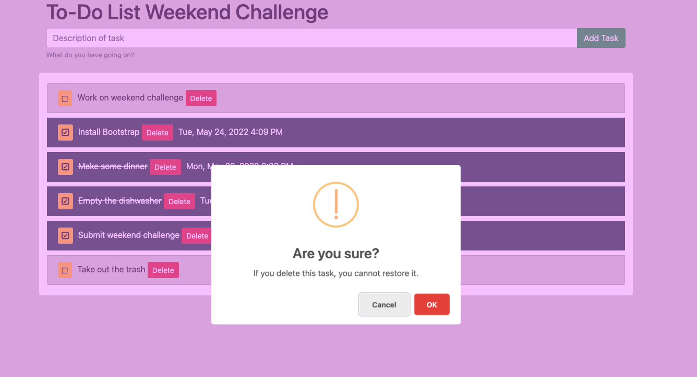

# To Do List

## Description

This is your classic to-do list. Enter in the task you want to complete. As you go along, you can delete a task once it is no longer necessary. Once you complete a task, you can click on the empty box button and it will complete the task. This 'complete' button is reversable so if you accidently complete a task, you can reverse that decision. However, once a task is deleted it can never be reversed. 

## Interface

##

## Installation

([Node.js](https://nodejs.org/en/) is used in this project)

To locally run the project...

1. Create a database named `weekend-to-do-app`,
2. The queries in the `database.sql` file are set up to create all the necessary tables and populate those tables with some sample feedack. The project is built on [Postgres](https://www.postgresql.org/download/), so you will need to make sure to have that installed. Using Postico is recommended to run those queries as that was used to create the queries 
3. Open up your code editor of choice and run `npm install` in your terminal to install the necessary dependencies
4. Run `npm run start` in your terminal to start up the server
5. In your browser go to `localhost:5001` to view the application

## Built with...

- JavaScript
- jQuery
- HTML
- CSS
- Express
- Node.js
- PostgreSQL
- Sweet Alerts
- Bootstrap

## Acknowledgement

Thanks to [Prime Digital Academy](www.primeacademy.io)!
